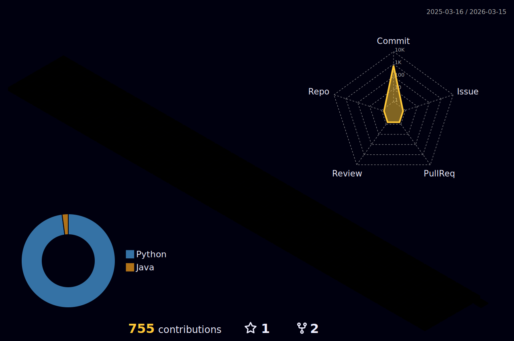

   Status

  

    Skills & Tools
  

  
  
  
  
   
   
  
  
  
   
  
   
   
  
  
  
  
  
  
  
   
   
  
  
  
  
  
  
  

   
   

  
  
  
  
  
  
  
   
   
  
 

 

##  블로그 최신 글

#### [2025-01-04 10:14:01 기준] 
[2024/09/29 - [Android] 프로젝트 개발 기록1 - splash animation 그리기 / github에 google-services.json 잘못 올림](https://ragabys.tistory.com/76)  
[2024/09/16 - [알고리즘] BOJ 3197 백조의 호수 (JAVA)](https://ragabys.tistory.com/69)  
[2024/07/20 - [Android] HLS in Android](https://ragabys.tistory.com/67)  
[2024/07/18 - [Android] Android Multi-Module](https://ragabys.tistory.com/66)  
[2024/06/22 - [알고리즘] BOJ 2812 크게 만들기 (JAVA)](https://ragabys.tistory.com/64)  
[2024/06/13 - [알고리즘] A* 알고리즘(A star 알고리즘)이 뭘까?](https://ragabys.tistory.com/63)  
